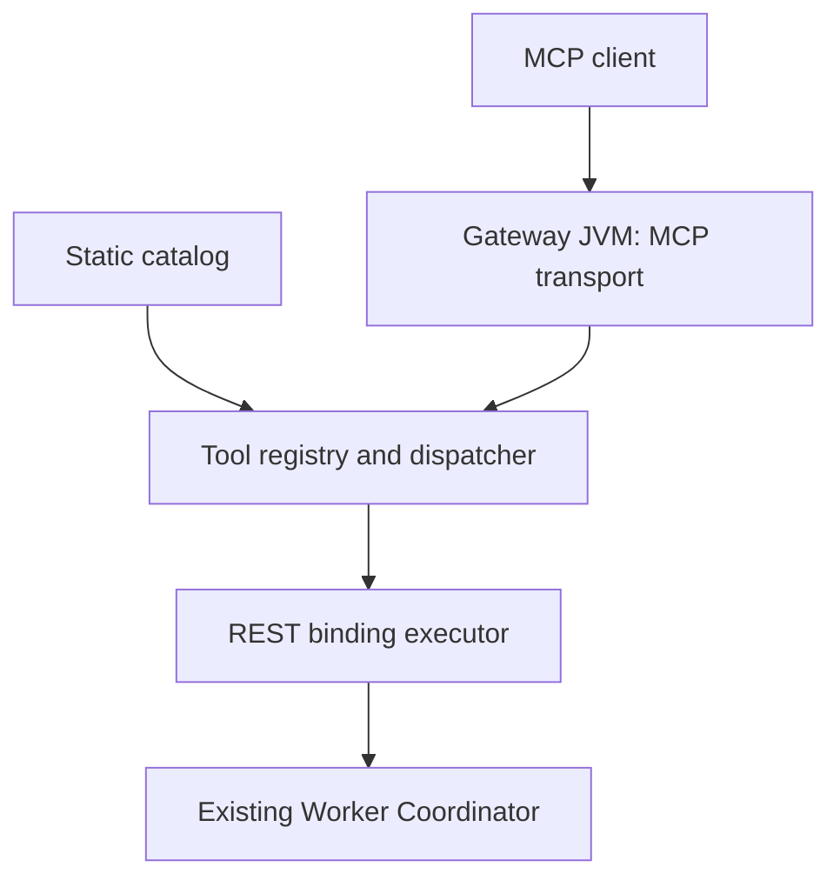

# Design: a Spring AI gateway with a virtual MCP server

Version: 1.0. Date: 7 October 2026. This document proposes an implementation; it does not claim a gateway has already been built.

## 1. Architectural decision

Start from a basic Spring Boot application and add the Spring AI MCP server transport. The application hosts the MCP-facing logical server and executes REST bindings. The existing Worker Coordinator continues to receive ordinary HTTP requests.

In this design, “materializing a virtual MCP server” means building an in-memory tool definition and execution handler from a static file, then registering that handler with the gateway's MCP transport. It does not mean creating a process, container or pod for each virtual server. Milestone 1 creates one logical server in one gateway JVM.

Spring Cloud Gateway is not needed to learn and implement this adapter. A later edge gateway may route or secure requests to it. Spring AI's MCP starter provides the protocol-facing machinery; application code supplies the catalog and the REST adaptation. Alibaba's gateway can be a reference for later features, but is not the project foundation.

## 2. Component boundaries



Only the gateway-to-coordinator edge uses the coordinator's REST contract. MCP discovery terminates in the gateway; it does not query the coordinator for schemas or tool metadata. The catalog is read during startup and is immutable during request execution.

Suggested Java responsibilities, using ordinary records and constructor injection:

| Component | Responsibility |
| --- | --- |
| `McpGatewayApplication` | Boot entry point |
| `GatewayProperties` | Catalog location, backend URL/token reference, timeout and body-limit settings |
| `FileCatalogLoader` | Read JSON, reject duplicate keys/unknown fields, validate the supported catalog subset |
| `ServerDefinition`, `ToolDefinition`, `RestBinding` | Immutable configuration records |
| `McpToolRegistrationConfiguration` | Convert catalog metadata into SDK tool specifications and register once |
| `ToolDispatcher` | Validate invocation arguments and select its immutable binding |
| `RestBindingExecutor` | Make the bounded HTTP request and select the returned ID |
| `McpResultMapper` | Produce success or sanitized execution-error results using SDK types |
| `McpOriginFilter` | Enforce the configured Origin policy on the transport endpoint |

These names are suggestions, not a demand for unnecessary class layers. Keep a single Maven module and a small package tree. Do not introduce a plugin loader, database, scripting language, tenant model or distributed registry.

## 3. Technology baseline and compatibility

Use Java 21 and Maven with a generated Wrapper. The official reference currently identifies Spring AI 2.0.1 as stable and states that the 2.0.x line supports Spring Boot 4.0.x and 4.1.x. Import `org.springframework.ai:spring-ai-bom` and select a compatible, resolvable stable Boot patch. Pin both versions in the build. Avoid snapshots. [S1]

For this new application, prefer the WebFlux MCP server starter and `WebClient`, with ASYNC handlers throughout request execution. The documented starter is `org.springframework.ai:spring-ai-starter-mcp-server-webflux`, and its Streamable HTTP switch is `spring.ai.mcp.server.protocol=STREAMABLE`. The endpoint is configured with `spring.ai.mcp.server.streamable-http.mcp-endpoint`. [S2]

Programmatic tool registration is preferred because definitions come from a file. Use the resolved Spring AI / Java SDK's supported asynchronous tool-specification registration mechanism. Check actual classes, builders, handler signatures and auto-configuration hooks in that version before writing code. Do not copy a synchronous constructor or annotation sample into ASYNC mode and assume it will register. The official Java SDK is maintained with Spring AI. [S3]

If an existing target repository must retain Boot 3.x, first verify an officially compatible Spring AI 1.1.x combination and adapt the APIs deliberately. Record the actual versions and reason in the README. Do not mix documentation from different major lines or silently override the BOM's MCP SDK version.

This handoff has not resolved Maven dependencies or compiled an implementation. Source inspection, dependency resolution and tests are Codex's first implementation checkpoint.

## 4. Static definition and deployment configuration

Use `examples/worker-catalog.json` as the initial application-owned catalog. It separates public tool metadata from a private binding. The catalog is not a standard MCP server configuration file supplied by Spring AI.

The `servers` array leaves room for a later catalog revision. Milestone 1 intentionally accepts exactly one server and one tool. It must fail on larger catalogs, rather than letting the starter merge all tools into one endpoint. Future multiple-server isolation needs explicit routing and registration work.

Store the backend origin, optional token and runtime budgets in deployment properties. Store the REST method, path, static body and response selector in the catalog. An operator integrates the real service by editing its binding and setting the backend origin. No client-supplied endpoint is accepted.

An illustrative `application.yml` for Codex to validate against the resolved dependency version:

```yaml
server:
  address: 127.0.0.1
  port: 8080
spring:
  ai:
    mcp:
      server:
        name: worker-coordinator
        version: 0.1.0
        type: ASYNC
        protocol: STREAMABLE
        request-timeout: 10s
        annotation-scanner:
          enabled: false
        tool-callback-converter: false
        capabilities:
          tool: true
          resource: false
          prompt: false
          completion: false
        tool-change-notification: false
        resource-change-notification: false
        prompt-change-notification: false
        streamable-http:
          mcp-endpoint: /worker-coordinator/mcp
gateway:
  catalog-location: ${GATEWAY_CATALOG_LOCATION:classpath:catalog/worker-catalog.json}
  backends:
    worker-coordinator:
      base-url: ${WORKER_COORDINATOR_BASE_URL:http://127.0.0.1:9090}
      bearer-token: ${WORKER_COORDINATOR_BEARER_TOKEN:}
  upstream:
    connect-timeout: 2s
    deadline: 5s
    max-response-bytes: 65536
  allowed-origins:
    - http://localhost:6274
    - http://127.0.0.1:6274
```

The `gateway.*` properties are proposed properties to implement, not built-in Spring properties. Local Inspector ports are examples and can be changed through configuration. They are not an authentication mechanism. Starter property keys must be verified in the chosen version. [S2]

The application validates that its sole catalog server ID, configured MCP server name and transport endpoint agree. Fix the milestone endpoint to `/worker-coordinator/mcp`; do not imply that arbitrary catalog endpoints automatically instantiate additional starter-managed servers. Keep annotations and tool-callback conversion disabled when low-level programmatic registration is used, to prevent duplicate registration.

## 5. Startup and request execution

Startup:

1. Bind deployment properties and validate budgets, backend references and URI rules.
2. Load the catalog and validate the supported format completely.
3. Construct an immutable tool/binding registry.
4. Build SDK tool metadata from the file and connect the execution handler to the REST executor.
5. Let Boot and the MCP SDK expose the configured transport. Startup failure must not leave an operational empty endpoint.

Do not contact the coordinator to allocate a test ID during startup. Successful configuration is independent of downstream reachability.

Invocation:

1. The MCP SDK resolves the transport/lifecycle and selected tool.
2. The application accepts only the declared empty arguments object.
3. Resolve the private binding and configured backend origin.
4. Execute the configured GET or POST exactly once, with an optional gateway-configured bearer token.
5. Bound the operation and response memory; do not follow redirects or retry.
6. Parse the JSON response and evaluate the compiled JSON Pointer.
7. Normalize the permitted string/integral ID into `workerId: string` without loss of precision.
8. Create an SDK tool result and let the SDK serialize the protocol response.
9. Emit one safe terminal log entry.

Perform no blocking HTTP calls or `.block()` inside a WebFlux handler. Use a reactive chain and propagate cancellation. Startup file reading may be synchronous before the server becomes usable.

## 6. Binding rules and validation

Use a fixed base origin with an absolute HTTP(S) URI, no userinfo, query or fragment. The demo may use HTTP on loopback. A binding path must be an absolute path beginning with `/`, not a full URL or scheme-relative `//...` reference. Reject traversal, including encoded traversal, query and fragment injection. Build a URI safely; verify that the resolved origin equals the configured origin. The supported path need not implement a full URI-template language.

No business arguments exist initially, so a general-purpose input JSON Schema validator is unnecessary. Enforce the supported empty-object shape explicitly. Validate that catalog schema definitions exactly express the supported contracts. Reject unsupported schemas instead of relying on metadata alone to enforce input validation.

For response parsing, use the application's compatible JSON library and integral number nodes or `BigInteger`; do not first convert to `double`. A string such as `"000123"` stays `"000123"`. An integral value such as `9007199254740993` becomes `"9007199254740993"`. Fractional IDs are rejected. Compile and validate the JSON Pointer during startup.

Catalog hints describe behavior to clients; they are not security controls. The default operation creates an allocation, so it is not read-only or idempotent. The demo's `destructiveHint: false` assumes allocation does not delete/overwrite resources; revisit that hint if the real business operation has different effects.

## 7. Result and failure mapping

Keep protocol failures separate from business execution failures. The SDK owns malformed messages, unsupported lifecycle and unknown tool handling. Application execution failures produce a tool result with `isError: true`; they must not become successful HTTP JSON objects outside MCP. [S4]

On success, the projected `workerId` object is both structured content and serialized JSON in text content. On error, omit structured content and use sanitized text JSON containing the application error code, message and conservative allocation outcome. This avoids making an error object violate the success-only output schema. [S4]

For an allocation timeout, a useful message is: “Worker Coordinator did not return within the configured deadline. An allocation may have occurred. Do not retry automatically.” The gateway cannot infer rollback from a disconnected HTTP client. Once an upstream request may have been sent, mark the outcome unknown even if the gateway sees an error status or invalid response.

Disable retries explicitly in the HTTP connector where it retries transient disconnects by default, as well as in application operators. Disable redirect following. No `.retry(...)`, retry filter or ID cache is appropriate for this first allocation tool. Connection reuse is allowed; allocation result reuse is not.

## 8. Runtime and deployment shape

For local development there are two independent running services: one gateway Boot process on port 8080 and the existing coordinator or a separate REST mock on port 9090. A smoke-client process connects to the gateway. The mock is an HTTP fixture, not an MCP upstream server.

In a future container deployment, the gateway could be one Deployment with a mounted read-only catalog and environment/secret-backed backend settings. Multiple virtual servers would be in-memory registrations within its JVM. They would not require a separate Deployment per logical server.

Do not implement Kubernetes or a production HA story in milestone 1. Streamable HTTP session state may be local to an instance depending on the selected SDK transport. Running multiple replicas can therefore require affinity or a separately designed session strategy; adding a second replica alone is not a complete solution. Stateless transport is a separate later decision, not a property to interchange casually with STREAMABLE.

The initial listener remains loopback-bound. Enforce the MCP Origin policy, including rejecting unapproved browser origins before tool execution. Nonbrowser clients need not send Origin. Remote service access requires an authentication boundary because the starter does not add one automatically. [S5, S6]

## 9. Verification strategy

Implement `FUNCTIONAL_SPEC.md` acceptance tests against a running server and an SDK client. Use a local mock HTTP server with recorded requests, controllable status/body/delay, and deterministic responses. A fresh application context can test startup catalogs and configuration overrides. Avoid a test that directly calls the Java dispatcher and calls that an MCP integration test.

Use time-bounded client calls and explicit await/polling helpers for mock observations. Avoid arbitrary long sleeps. Count requests to prove discovery has no side effects and errors have no retries. Test large integral IDs, duplicate returned IDs and a canary secret in an upstream error. Assert output-schema conformity on successes and absence of structured error output.

Supply a standalone smoke client using the same compatible SDK family. It connects, lists tools, makes an explicit allocation call and displays the returned result. Its README must say that running the allocation step consumes a real ID when pointed at the real coordinator. Unit/integration fixtures must not contact the real service.

## 10. Incremental implementation and later roadmap

| Stage | Build now | Evidence before proceeding |
| --- | --- | --- |
| 1A | Boot skeleton, pinned dependencies, Wrapper | Application starts without a model key |
| 1B | REST executor and separate HTTP mock | Exact requests, precision-safe ID extraction, bounded failures |
| 1C | Catalog loading and programmatic MCP registration | SDK discovery shows file-derived metadata |
| 1D | Actual MCP-to-REST invocation and error mapping | End-to-end criteria pass |
| 1E | External config, README, smoke client | Reproducible local demonstration |

Future milestones, each implemented and verified separately:

1. Expand the schema/binding model to multiple tools and explicit input-to-REST mappings.
2. Host multiple isolated logical MCP servers, each with its own path and discovery scope. Design SDK transport instances and routing explicitly; do not merely merge all tools into the starter's single server.
3. Add a separate native-MCP binding executor using MCP client connections, capability negotiation, tool aliasing and intentional downstream error/authentication policies. A native MCP server is contacted over MCP, not converted to REST by assumption.
4. Add validated reload with an atomic registry snapshot. Handle existing sessions, active calls and supported change notifications deliberately; an invalid revision must leave the last good snapshot in use.
5. Add remote access controls, quotas, observability and deployment/session scaling.
6. Introduce a control-plane source behind a small catalog-provider boundary only when static files become insufficient.

Milestone 1 keeps configuration models independent of transport and the REST executor independent of SDK envelope serialization. These two boundaries allow growth without designing a complete enterprise platform today.

## 11. Official references and verification notes

Checked on 7 October 2026. Requirements and architectural choices above are this project's proposed design; the references establish framework/protocol behavior, not an endorsement of this design by those projects.

- **S1 — Spring AI Getting Started:** https://docs.spring.io/spring-ai/reference/getting-started.html — supported Boot lines and BOM usage.
- **S2 — Spring AI Streamable HTTP Server:** https://docs.spring.io/spring-ai/reference/api/mcp/mcp-streamable-http-server-boot-starter-docs.html — starter, transport switch, endpoint property and registration options.
- **S3 — Official Java MCP SDK:** https://github.com/modelcontextprotocol/java-sdk — SDK source; inspect the version selected by the BOM.
- **S4 — MCP tools, versioned reference:** https://modelcontextprotocol.io/specification/2025-06-18/server/tools — discovery/calls, structured results and execution errors.
- **S5 — MCP transport, versioned reference:** https://modelcontextprotocol.io/specification/2025-06-18/basic/transports — Streamable HTTP and Origin handling.
- **S6 — Spring AI MCP Server Starter:** https://docs.spring.io/spring-ai/reference/api/mcp/mcp-server-boot-starter-docs.html — starter capabilities and default authentication behavior.

The versioned protocol pages are a stable reference for the features used here. They are not a requirement to hard-code that protocol version; the implemented SDK must negotiate one it actually supports and record the tested version. Recheck framework documentation if implementation happens after this handoff date.
