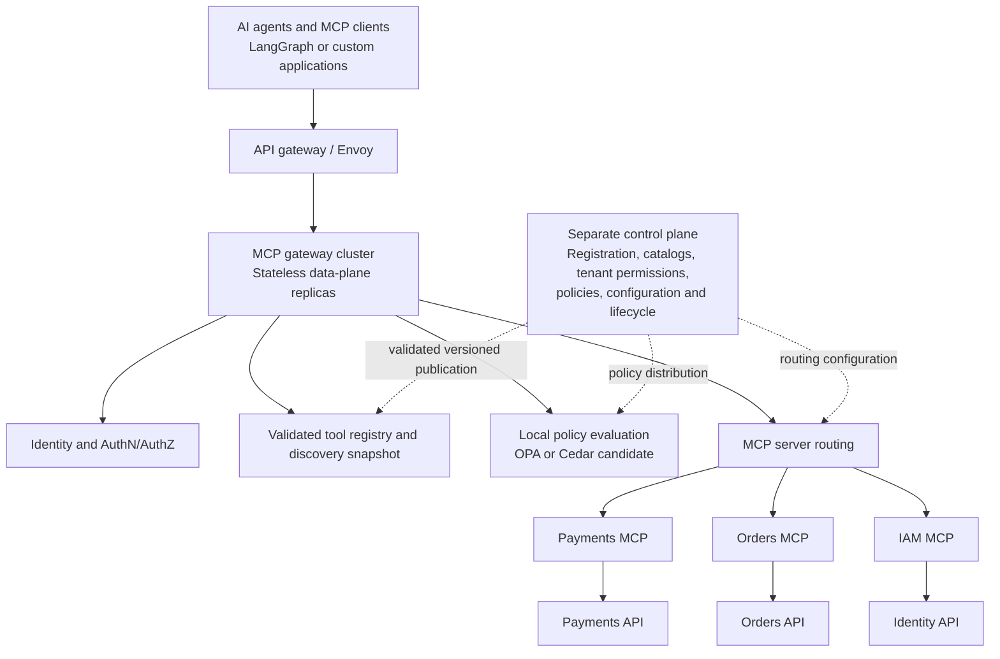

# Enterprise MCP gateway and control plane

Status: owner-selected strategic direction, recorded 2026-10-08. This document
guides project context and future design work. It does not request implementation
or change the completed foundation's external contract, dependency versions,
acceptance evidence or running services.

## Objective and current position

Design a platform that manages hundreds of MCP servers, thousands of tools,
multiple tenants and many concurrent agents, with security, reliability,
observability and operational control. These are design targets, not measured
capacity claims. The platform should be independently useful with any compatible
MCP client, regardless of the LLM provider, LangGraph or another agent framework.

Organize the platform around four core subsystems: **federation, identity, policy
enforcement and resilient execution**. Treat observability and governance as
responsibilities across all four. The engineering value is their integration
under concurrency, failures and adversarial conditions.

The existing [foundation](IMPLEMENTATION_PLAN.md) is a learning and evidence base:
one SDK-owned MCP server, immutable startup catalogs, REST adaptation, bounded
execution, opt-in JWT admission and independent failure tests. It does not yet
provide native MCP federation, a dynamic registry, a control plane, distributed
tenant quotas or stateless gateway clustering. Its tested protocol is
`2025-11-25`; its session-owner protections remain relevant to that implementation.

The earlier [multiple virtual servers proposal](MULTIPLE_VIRTUAL_SERVERS.md) and
[ADR 0005](decisions/0005-multiple-virtual-servers.md) describe separate local SDK
servers/endpoints in one process. They remain proposals. That topology and a
unified catalog federating remote MCP servers solve different problems; revisit
their relationship when selecting an implementation slice. The original
[functional specification](FUNCTIONAL_SPEC.md) remains authoritative for the
completed foundation. Enterprise phases below are a separate roadmap.

## Target architecture



The **data plane** processes requests: authenticate, validate, authorize, select
an upstream, enforce budgets and limits, stream results and emit telemetry. Keep
control-plane availability out of the normal invocation's synchronous dependency
chain. Identity infrastructure and business services have their own availability
dependencies and failure policies.

The **control plane** registers/deregisters servers, manages tool metadata and
tenant permissions, validates schemas and policies, and publishes routing and
lifecycle changes. Administration needs its own authenticated, authorized and
audited interface; registering an endpoint must not implicitly approve its tools.

Publish complete, versioned configuration snapshots. Validate integrity, schema,
ownership and referential consistency before atomic activation. Retain a durable
last valid snapshot and its policy generation so existing admitted traffic can
continue during a temporary control-plane outage. Reject invalid updates; prove
restart from a retained snapshot and rollback to a previously valid generation.

Availability from a retained snapshot has a security cost: a revoked permission
may be stale. Define a maximum configuration age and measured revocation window,
with explicit fail-closed behavior for expired or high-risk permissions. A cold
replica without valid configuration must not accept protected traffic. An
administrator's disable operation needs a measured propagation bound, including
the policy for already-started calls and tasks; do not promise instant global
revocation during a partition.

## Capability priorities

P0 is essential platform correctness, P1 makes the platform operable at scale,
and P2 adds advanced protocol capabilities where every hop supports them.

| Capability | Advanced engineering requirement | Priority |
| --- | --- | --- |
| MCP protocol handling | Revision compatibility, Streamable HTTP, JSON-RPC, notifications and error semantics through compatible official SDKs | P0 |
| Federated tool registry | Aggregate upstream tools, deterministic namespaces, dynamic updates and tenant-specific discovery | P0 |
| Enterprise security | OAuth/OIDC, issuer/audience validation, delegated and service identity, tenant isolation and downstream credential boundaries | P0 |
| Policy enforcement | Per-tool permissions, argument-sensitive decisions and authorized response controls | P0 |
| Intelligent routing | Server discovery, endpoint health, load balancing and retries only under an explicit safe replay contract | P0 |
| High availability | Stateless request replicas, external durable state where needed, safe recovery, draining and graceful shutdown | P0 |
| Traffic management | Tenant/tool/server rate and concurrency limits, total deadlines, bounded queues and backpressure | P1 |
| Observability | End-to-end traces, metrics, policy audits and tool-level usage accounting | P1 |
| Governance | Versioning, approval, deprecation, allowlists and controlled rollout/rollback | P1 |
| Advanced MCP features | Tasks, progress, cancellation, elicitation and supported server-to-client interactions | P2 |

## First major subsystem: federated registry

Start future implementation with federation. A useful design exercise is 50
servers exposing 500 tools; it is a workload model, not proof of capacity.
Present a unified catalog while retaining upstream ownership, schema version,
security context and lifecycle state for every tool.

Build registration/deregistration, authenticated upstream discovery, collision
handling, schema/metadata versioning, tenant-filtered catalogs, deterministic
ordering and cache invalidation. Support health-aware endpoint selection and safe
hot deployment/removal. Discovery refresh belongs to the control plane; each
invocation belongs to the data plane and must be independently authorized.

Maintain an operator-controlled mapping, for example:

```text
payments.refund
  -> public tool identifier + catalog version
  -> registered payments-mcp cluster
  -> approved endpoint + downstream credential audience
  -> upstream tool refundPayment + schema version
```

An LLM never generates a routing target. Namespace assignments must be stable,
unique and validated against the selected protocol's identifier rules. Tool
descriptions and annotations are upstream metadata, not authorization policy.
Validate registration destinations against the deployment's trust/egress rules;
an untrusted server must not turn registry refresh into arbitrary network access.

Version discovery views and pagination/caches so callers do not see mixed catalog
generations. A call resolves a validated mapping and schema consistently; current
authorization and disable policy still apply. A discovered tool may later become
unavailable. Define how removal rejects new calls, drains existing work and keeps
task ownership resolvable. Rollback must not silently re-enable revoked access.

## Identity and policy enforcement

The intended delegated trust chain is:

```text
Human user -> OIDC authentication -> AI application / agent
  -> gateway access token
  -> gateway validates issuer, audience, tenant and caller
  -> tool and argument policy evaluation
  -> downstream-scoped credential
  -> trusted MCP server -> business service
```

Support user-delegated and service-identity operations as distinct modes. Record
the actor, represented subject, tenant and delegation constraints when present;
derive these from trusted identity sources, not caller-supplied tool arguments.
An agent may read an order without being permitted to refund it. Refund admission
must satisfy both the represented user's permissions and business policy.

Evaluate token exchange and least-privilege downstream credentials, explicit
per-tool scopes, argument-based ABAC, credential rotation and response controls.
Bind credentials to the selected trusted server and audience. Never pass the
incoming gateway bearer token to an arbitrary upstream. Keep credentials out of
catalogs, logs, traces and public results. Downstream authorization and tenant
storage isolation remain separate business-service obligations.

Tenant-specific discovery reduces exposure but never substitutes for execution
authorization. Task lookup/cancellation, administration, caches and telemetry
also need tenant and owner boundaries. Policy errors, missing trusted attributes
and unsupported obligations must have explicit fail-closed behavior. Response
filtering must preserve the advertised result schema or return a defined error.

Use the existing [secured foundation](SECURED_MCP.md) and
[threat model](SECURITY_THREAT_MODEL.md) as evidence for limited current admission,
not as proof of enterprise OAuth delegation, token exchange or policy distribution.

## Transport, routing and high availability

Protocol findings were checked against official sources on 2026-10-08. Revision
`2026-07-28` carries version and capabilities on each request instead of an
initialization session. The current repository implements the earlier era;
supporting both requires a tested compatibility decision and SDK/starter API
inspection, not a property change. See [official versioning and compatibility](https://modelcontextprotocol.io/specification/2026-07-28/basic/versioning).

The newer HTTP binding uses POST with JSON or request-scoped SSE responses,
mirrors request metadata into routing headers, requires rejecting mismatches,
and does not support SSE resumption via `Last-Event-ID`. Disconnecting an SSE
response signals cancellation; it does not establish business rollback. Validate
these behaviors at every proxy and SDK hop. See [official Streamable HTTP](https://modelcontextprotocol.io/specification/2026-07-28/basic/transports/streamable-http).

Separate two execution paths:

| Path | Routing and state model |
| --- | --- |
| Normal requests | Client -> any healthy gateway replica -> selected MCP replica -> response. A later request may select different replicas where upstream semantics permit. |
| Long-running Tasks | Client -> gateway -> authorized durable task lookup -> owning MCP server/worker. Task state and ownership survive gateway replacement; worker failover requires its own demonstrated contract. |

The versioned Tasks extension defines `tasks/get`, `tasks/update` and
`tasks/cancel`, with capability requirements and task-ID routing. Cancellation
acknowledges intent and can race completion; it does not guarantee work stopped.
Use durable task metadata scoped by tenant, subject and upstream ownership;
never assume a task ID is globally unique across servers. See the
[official 2026-07-28 Tasks extension](https://modelcontextprotocol.github.io/ext-tasks/specification/2026-07-28/tasks.html).

Demonstrate header/body validation, incremental streaming without full-response
buffering, cancellation/disconnect propagation, bounded concurrent streams and
backpressure. Bound queued work, response/event sizes and time budgets without
turning a long-lived stream into an unbounded in-memory buffer. Draining should
stop new admissions and define a finite completion/cancellation window.

Terminate a gateway replica during active synthetic traffic and distinguish
completed calls, lost responses, in-flight work, cancellation and safely retryable
requests. New requests can continue on surviving replicas; a broken response
stream is not transparently recovered. Task status retrieval may reconcile work
only where the task contract permits it. Legacy sessions need an explicit routing
or migration strategy and cannot simply be declared stateless.

Retries belong to the invocation's total deadline and upstream replay contract.
Health signals or a transport failure do not prove a mutation was uncommitted.
The foundation's payment key survives attempts within one invocation, not fresh
calls; its [response-loss evidence](SECURED_MCP.md) must not be generalized into
automatic replay for federated tools.

## Governance, observability and traffic control

The administrative control plane should answer who invoked a tool, which identity
authorized it, which tenant and policy applied, which upstream handled it, and
which tools are failing or slowing down. Record configuration/schema/policy
versions and correlation identifiers so an invocation can be explained later.

Use distributed tracing across gateway and instrumented upstreams, policy-decision
audits, tool usage/error/latency metrics, quotas and circuit breakers. Audit
records should capture decisions and outcomes without raw tokens or unrestricted
argument/result bodies. Define audit delivery behavior during telemetry outages;
avoid unbounded request blocking or unbounded queues. Keep metric labels bounded
rather than adding arbitrary subjects, request IDs or every argument value.

Measure request counts, concurrency, stream duration, bytes and credential/token
exchange operations. LLM token usage is only measurable with cooperating host or
provider instrumentation; an LLM-independent MCP gateway cannot infer it reliably
from tool HTTP traffic. Do not log token material to implement metering.

Provide tool approval/versioning/deprecation, controlled 10% canary rollout,
schema compatibility validation, emergency disable and configuration rollback.
Define stable tenant-aware rollout selection and policies for in-flight calls.
Tool-level circuit breaking should allow restricting `payments.refund` while
keeping `payments.getPayment` available, with shared server health still respected.

Enforce tenant isolation under saturation: rate/concurrency quotas, bounded
queues, deadlines and overload responses should restrict the offending tenant
without exhausting the entire cluster. Specify which limits are local per
replica and which are global; prove behavior during coordination failure.

## Enterprise roadmap

These enterprise phases use **E1-E4** to avoid confusing them with the completed
foundation milestone 1. All are pending; this context update starts none of them.

| Phase | Selected direction for a future implementation request | Required demonstration |
| --- | --- | --- |
| E1 - Federated gateway | Register three independent MCP servers, aggregate catalogs, route dynamically and run at least two gateway replicas | Deterministic mapping, catalog consistency, discovery without mutations, safe update/removal and surviving-replica service for new calls |
| E2 - Security and policies | Integrate Keycloak, tenant-aware admission, per-tool/argument policy and isolated downstream credentials | Delegated versus service identity, audience rejection, tenant/owner denial, no token passthrough and measured revocation |
| E3 - Transport and resilience | Streaming, cancellation, supported Tasks routing, deadlines, concurrency limits, draining and failure tests | Proxy/SDK compatibility, bounded resources, explicit replay semantics, replica failure outcomes and durable task lookup |
| E4 - Production control plane | Audit trails, dashboards, dynamic policies, tool versions, traffic shaping and benchmarks | Validated snapshot publication, outage behavior, canary/rollback, overload isolation and reproducible capacity evidence |

P0 safeguards remain prerequisites for any exposed deployment. E1 should use
independent synthetic servers with bounded execution and trusted registrations;
its ordering is not permission to defer all authentication or validation until E2.
Each selected phase needs a bounded implementation plan and concrete acceptance
evidence before coding. Existing learning exercises can continue independently.

## Build versus reuse

These are preferred candidates to evaluate, not selected dependency versions or
authorization to install infrastructure. Keep the pinned foundation stack until
an implementation decision has official compatibility evidence and an ADR.

| Component | Direction |
| --- | --- |
| MCP protocol | Reuse compatible official SDKs; SDKs own envelopes and revision semantics |
| Gateway orchestration | Build routing, admission, lifecycle and coherent execution guarantees |
| Server/tool registry | Build the domain model, validation, discovery views and publication workflow |
| OAuth/OIDC | Keycloak candidate; explicit trust and delegation model |
| Authorization | Evaluate OPA or Cedar against latency, obligations and distribution requirements |
| HTTP ingress/proxy | Envoy target; Spring Cloud Gateway alternative requiring a scoped decision |
| Registry persistence | PostgreSQL candidate for durable registrations, versions and publication state |
| Distributed cache | Redis candidate; define authoritative state and outage behavior separately |
| Telemetry | OpenTelemetry candidate with compatible collectors and upstream instrumentation |
| Deployment | Kubernetes candidate for replica management, readiness and controlled rollout |
| Architectural comparison | Compare IBM ContextForge; adoption is a separate build/reuse decision |

## Working process and Principal Engineer evidence

For every future design or implementation slice, state the external contract,
trust boundaries, state ownership, concurrency model, failure semantics and
measurement plan. Trace one invocation across discovery, authentication, policy,
mapping, credentials, limits, execution and audit; also trace its configuration
update/removal and failure paths. Record consequential decisions and test the
interactions rather than declaring completion from separate module tests.

| Scenario | Guarantee to demonstrate, with measured limits |
| --- | --- |
| Gateway replica crashes | Surviving replicas serve new requests; completed, in-flight and lost-response outcomes are distinguished |
| Registry/control plane unavailable | Replicas use a valid retained snapshot within its allowed age; invalid/cold startup and expiry fail as specified |
| User loses authorization | Revocation propagates within a measured window, including cache, partition and task behavior |
| Tool schema changes | Incompatible changes are rejected before activation; approved versions route consistently |
| Malicious MCP server responds | Tenant/credential boundaries and response/stream limits hold; untrusted metadata does not become policy |
| Tenant exceeds quota | Only that tenant is restricted within documented shared-resource limits |
| Slow MCP server | Total deadlines, bounded concurrency/queues and circuit state protect other work |
| Tool deployment fails | A validated prior routing/catalog generation can be restored without weakening current security policy |

Define workload dimensions before benchmarks: server/tool/tenant counts, concurrent
agents and streams, read/write mix, schema/result sizes and failure injection.
Measure throughput, latency percentiles, resource use, fairness, error rates and
recovery/propagation windows. Label design targets, independent mock evidence,
local operational evidence and production claims separately. A standalone
platform with defensible system-wide guarantees is the portfolio objective;
a sophisticated LLM agent above it is optional.
