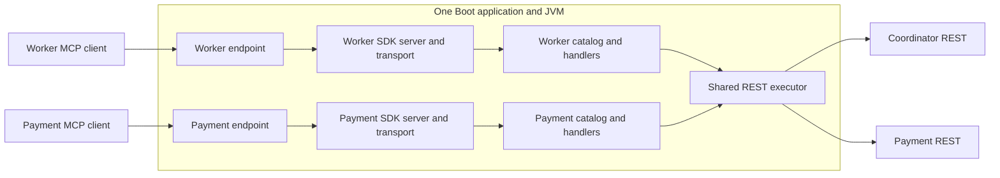

# Multiple virtual MCP servers in one application

Status: proposed design, not implemented. Date: 2026-10-07.
Keep the current Java 21 / Boot 4.0.8 / Spring AI 2.0.1 / MCP SDK 2.0.0 baseline.
The design targets the SDK's currently verified Streamable HTTP behavior and
negotiated protocol 2025-11-25; protocol upgrades are a separate decision.

## Endpoint and ownership model

One Boot JVM and one HTTP listener host multiple independent SDK servers:

| Logical server | Endpoint | Public tools | Allowed private backend |
| --- | --- | --- | --- |
| `worker-coordinator` | `/worker-coordinator/mcp` | Nine namespace/worker tools | `worker-coordinator` |
| `payments` | `/payments/mcp` | `create_sample_payment` | `payment-api` |



Every virtual server owns its server identity/capabilities, immutable tool index,
SDK McpAsyncServer, WebFluxStreamableServerTransportProvider and session state.
All virtual servers share schema validation, tool-invocation/result mapping code,
REST execution, backend settings, JSON serialization and observability code.
HTTP connection pools may be shared by backend with bounded capacity.

Distinct endpoints expose distinct discovery results. A worker client cannot
discover or call payment tools through the worker endpoint. A session initialized
on the worker endpoint is unknown to the payment transport, including on GET,
POST and DELETE. Never reuse one transport provider for different server objects:
its session factory and session map belong to a single SDK server.

This is catalog/protocol isolation within a shared process. JVM failure, heap
exhaustion and CPU contention can still affect all virtual servers. Add finite
per-server session limits and nonblocking invocation concurrency limits; use
separate processes if stronger resource or security isolation becomes necessary.
Endpoint separation alone is not caller authentication or authorization.

## Catalog and deployment settings

Introduce schema version 4 rather than relaxing versions 1–3. Reuse the current
tool definitions and supported flat schemas/mappings under separate server
entries. The following is a structural illustration; full tool schemas, hints
and bindings are omitted:

```json
{
  "schemaVersion": 4,
  "servers": [
    {
      "id": "worker-coordinator",
      "version": "0.1.0",
      "tools": [{"name": "get_product"}, {"name": "acquire_worker"}]
    },
    {
      "id": "payments",
      "version": "0.1.0",
      "tools": [{"name": "create_sample_payment"}]
    }
  ]
}
```

Derive the endpoint as `/{serverId}/mcp`; do not let clients select it. Validate
server IDs with a bounded lowercase identifier syntax, e.g.
`[a-z][a-z0-9-]{0,63}`. This preserves the existing worker URL and prevents
traversal or ambiguous path mappings. Reject duplicate IDs/routes, duplicate tool
names within a server, invalid bindings/schemas and unconfigured backends.
The same tool name may exist on different servers; internal identity is
`(serverId, toolName)`, never a global tool-name lookup.

One file can contain multiple logically isolated catalogs. Separate resource
files are optional future authoring convenience, not required for isolation.
Do not add per-server processes, child Spring contexts, a database, plugin
framework or dynamic loading merely to separate discovery.

Deployment policy should be keyed by server ID, outside public catalog metadata:
allowed backend references, allowed Origins, MCP request budget, session limits
and invocation concurrency. Reject policy entries for unknown servers and any
catalog binding outside its server's backend allowlist. Backend origins/tokens
stay in the existing private deployment backend map. Validate the REST deadline
against the enclosing server budget. Do not expose these policies in tools/list.

## Startup and routing

1. Bind private deployment settings and load/validate the entire catalog once.
   Build immutable ServerDefinition records and per-server tool maps. Make no
   upstream requests. Fail the application on invalid definitions.
2. For each server, construct a separate WebFluxStreamableServerTransportProvider
   using the resolved mapper and `messageEndpoint(derivedPath)` API.
3. Build a separate McpAsyncServer with `McpServer.async(provider)`, its identity,
   tools-only capabilities, validated tools and enclosing request budget. Each
   handler captures its own tool definition and server policy.
4. Publish the providers' getRouterFunction() results as one composed WebFlux
   RouterFunction. Compose SDK routes directly; do not rewrite paths or parse
   MCP bodies to choose a server. The SDK handles negotiation, envelopes,
   sessions, unknown tools, GET streams and DELETE termination.
5. Own the server/provider pairs in a managed VirtualServerRuntime collection.
   If startup fails partway through, close already-created runtimes. At shutdown,
   stop admitting work and perform bounded SDK graceful closure before disposing
   shared connection pools. Respect SDK ownership to avoid double closure.

Use explicit SDK construction in the new opt-in multi-server configuration.
Disable the starter's default single-server construction and transport routing
there (the inspected common and Streamable WebFlux auto-configurations), or use
`spring.ai.mcp.server.enabled=false` to make them back off. The custom manager
must use its own application setting, such as proposed `gateway.enabled`, rather
than the disabled starter flag. Configure its JSON mapper, capabilities, budgets
and runtime lifecycle explicitly. Do not publish all tool specifications as
global registration beans in this mode.

The inspected Spring AI 2.0.1 common auto-configuration builds one async server
from all supplied tool-specification lists; its WebFlux auto-configuration creates
one provider/route set. Additional list beans would therefore combine discovery,
and multiple provider beans alone would cause ambiguous single-provider injection.
The explicit manager avoids those assumptions without changing dependencies.

## Changes to the current code

| Component | Proposed change |
| --- | --- |
| FileCatalogLoader | Return an immutable collection of ServerDefinition records; retain strict legacy handling |
| ServerDefinition (new) | Server ID/version, derived endpoint, immutable tool map |
| ToolInvoker (extracted) | Move existing argument validation, REST invocation, result mapping and terminal logging out of singleton registration configuration |
| VirtualServerManager (new) | Construct scoped SDK servers/providers and compose routes; own startup/shutdown |
| McpOriginFilter | Match every registered endpoint from validated server policies before the SDK executes any operation |
| GatewayProperties | Add explicit virtual-server policy and allowlist settings; retain separate private backend origins/tokens |
| McpSmokeClient | Accept an endpoint option and explicit tool/arguments for calls; remain discovery-only by default |

The shared invoker receives server identity and a validated tool definition, not
a client-provided backend or a global tool-name registry. Log serverId alongside
tool, correlation ID, duration and safe outcome category. Preserve ASYNC request
handling, exact integer projection, sanitized errors, current user-directed
retry behavior, response limits, Origin rules and cancellation semantics.

## Migration and proof

Keep current profiles/catalogs available while introducing an opt-in multi-server
profile. In that mode worker discovery contains nine tools at the existing path,
and payment discovery moves to `/payments/mcp`. Clients expecting the current
combined worker endpoint must configure a separate payment connection when
switching. Do not silently redirect stateful MCP requests or preserve a hidden
global fallback catalog.

When the user resumes automated tests, prove isolation through two real SDK
clients and independent random-port REST mocks:

- Each initialize response has the proper identity; each tools/list exposes only
  its server's metadata, with zero backend requests during startup/discovery.
- Worker endpoint rejects a payment tool name without touching either backend;
  the reverse also holds, with the SDK owning unknown-tool behavior.
- Same-named tools on two servers execute their own bindings and credentials.
- A session header from server A is rejected by server B on POST/GET/DELETE;
  terminating A's session leaves B's session usable.
- Correct calls use the proper backend/token, project the declared fields and
  preserve epoch/ID precision. Invalid arguments and unapproved Origins invoke
  no REST request on either endpoint.
- Duplicate server IDs/routes, duplicate names within one server, disallowed
  backend references and invalid catalogs fail startup before routes are usable.
- Backend outage does not prevent discovery of either catalog. Saturating A's
  invocation/session allowance does not consume B's reserved allowance. Startup
  failure/shutdown close sessions, streams and created runtime resources.

## Evidence and sources

This is a proposed architecture; no runtime code was changed and no tests ran.
Source inspection used the resolved SDK 2.0.0 and Spring AI 2.0.1 artifacts.
The WebFlux provider has an instance session map, a single session factory,
GET/POST/DELETE routes on its configured endpoint and graceful closure.

- [Spring AI 2.0.1 Streamable HTTP starter](https://docs.spring.io/spring-ai/reference/api/mcp/mcp-streamable-http-server-boot-starter-docs.html)
- [Matching WebFlux transport sources](https://repo.maven.apache.org/maven2/org/springframework/ai/mcp-spring-webflux/2.0.1/mcp-spring-webflux-2.0.1-sources.jar)
- [Matching common auto-configuration sources](https://repo.maven.apache.org/maven2/org/springframework/ai/spring-ai-autoconfigure-mcp-server-common/2.0.1/)
- [MCP 2025-11-25 transport/session rules](https://modelcontextprotocol.io/specification/2025-11-25/basic/transports)

See [ADR 0005](decisions/0005-multiple-virtual-servers.md).
